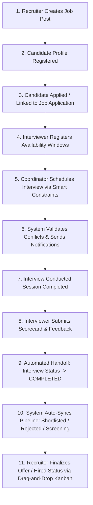

# SlotScore 🎯
### Enterprise Interview Scheduling & Recruitment Pipeline Management Application


---

## 📌 Executive Summary

**SlotScore** is an enterprise-grade recruitment lifecycle management system designed to eliminate operational redundancy between recruiters, interviewers, and hiring managers. By leveraging smart constraint-driven interview scheduling and automated status handoffs upon feedback submission, SlotScore simplifies candidate tracking, enforces interviewer availability windows, and automates hiring pipeline stage transitions without manual recruiter double-entry.

---

## ✨ Core Features & Architectural Highlights

### ⚡ 1. Automated Feedback Handoff & Pipeline Sync
- **Automatic Status Transition**: Submitting an evaluation via the `InterviewFeedbackModal` immediately marks the corresponding `Interview` status as `COMPLETED`.
- **Linked Pipeline Stage Transition**: Automatically updates the candidate's `JobApplication` status based on the feedback's performance outcome:
  - **Recommended (Pass / Score $\ge$ 4)** $\rightarrow$ Moves application to `SHORTLISTED`
  - **Not Recommended (Reject / Score $\le$ 2)** $\rightarrow$ Moves application to `REJECTED`
  - **On Hold / Review (Score = 3)** $\rightarrow$ Moves application to `SCREENING`
- **Candidate Profile Sync**: Simultaneously synchronizes the candidate's profile status (`HIRED`, `REJECTED`, `SCREENING`) across all system views.

### 🗓️ 2. Smart Constraint-Driven Scheduling Engine
- **Application-Bound Job Position**: Automatically derives and locks target job openings directly from active `JobApplication` records.
- **Autofilled Candidate Availability**: Pre-fills interview dates from candidate profile windows, constraining scheduling to valid candidate availability.
- **Dynamic Interviewer Filtering**: Queries active availability slots and scheduled interview conflicts to present **only** free and unassigned interviewers for any given date and time slot.

### 🔐 3. Role-Based Access Control (RBAC)
- **Recruiter**: Job post creation, candidate pipeline tracking, final hiring decisions, drag-and-drop Kanban management.
- **Interviewer**: Slot availability management, conducting assigned interviews, evaluating candidates, submitting feedback scorecards.
- **Coordinator**: Interview scheduling, session rescheduling, notification dispatch.
- **Admin**: Full system management, user role assignment, audit log inspection, platform monitoring.

### 📊 4. Interactive Kanban Pipeline & Drag-and-Drop
- Intuitive 6-stage recruitment Kanban funnel (`APPLIED`, `SCREENING`, `SHORTLISTED`, `INTERVIEWING`, `HIRED`, `REJECTED`).
- Native HTML5 Drag-and-Drop interface allowing recruiters to effortlessly move candidate cards across pipeline stages.

### 📜 5. Audit Logging & System Transparency
- Comprehensive audit trails for every key action: interview scheduling, feedback submissions, status updates, and user modifications.

---

## 🛠️ Technology Stack

| Layer | Technology |
| :--- | :--- |
| **Backend Framework** | Java 17, Spring Boot 3.x, Spring MVC |
| **Persistence & Database** | Spring Data JPA, Hibernate, MySQL |
| **Security & Auth** | Spring Security, JJWT (JSON Web Token), BCrypt |
| **Frontend Framework** | React.js 18, React Router v6 |
| **Build Tooling** | Vite, Apache Maven |
| **Styling & UI** | Vanilla CSS, Modern Theme Tokens (Light/Dark Mode), Google Fonts |
| **HTTP Client** | Axios (with Bearer Token Interceptors) |

---

## 📁 Repository Structure

```text
interviewschedulermanagement/
├── src/main/java/com/appdev/interviewschedulermanagement/   # Spring Boot Backend
│   ├── config/              # Security, CORS, JWT Configurations
│   ├── controller/          # REST Endpoint Controllers
│   ├── dto/                 # Request & Response Data Transfer Objects
│   ├── enums/               # Application Enums (UserRole, Status, etc.)
│   ├── exception/           # Global Exception Handlers
│   ├── mapper/              # Entity <-> DTO Mappers
│   ├── model/               # JPA Entities (Interview, Candidate, User, etc.)
│   ├── repository/          # JPA Data Repositories
│   └── service/             # Business Logic & Pipeline Automation Services
├── reactapp/                # React.js Frontend App (Vite)
│   ├── src/
│   │   ├── components/      # Reusable UI Modals (Schedule, Feedback, Reschedule)
│   │   ├── context/         # AuthContext & State Management
│   │   ├── pages/           # Page Views (Dashboard, Interviews, Candidates, etc.)
│   │   ├── services/        # Axios API Service Wrappers
│   │   ├── App.jsx          # Router & Global Font/Theme Application
│   │   └── index.css        # Core Design System & CSS Custom Variables
│   ├── index.html           # HTML Template & Google Web Fonts
│   └── vite.config.js       # Vite Configuration
├── pom.xml                  # Maven Dependency Specification
└── README.md                # Project Documentation
```

---

## 🚀 Getting Started & Setup Guide

### 📋 Prerequisites
Ensure you have the following installed locally:
- **Java Development Kit (JDK 17 or higher)**
- **Node.js (v18.x or higher) & npm**
- **MySQL Database Server (v8.x)**
- **Apache Maven**

---

### ⚙️ 1. Database & Backend Configuration

1. Create a MySQL database named `interviewschedulermanagement`:
   ```sql
   CREATE DATABASE interviewschedulermanagement;
   ```

2. Update database credentials in `src/main/resources/application.properties` (if required):
   ```properties
   spring.datasource.url=jdbc:mysql://localhost:3306/interviewschedulermanagement?createDatabaseIfNotExist=true
   spring.datasource.username=root
   spring.datasource.password=your_password
   ```

3. Run the Spring Boot backend server:
   ```bash
   # From root project directory
   mvn spring-boot:run
   ```
   The backend REST API will start on `http://localhost:8080`.

---

### 💻 2. Frontend Setup & Launch

1. Navigate to the `reactapp` directory and install dependencies:
   ```bash
   cd reactapp
   npm install
   ```

2. Launch the Vite development server:
   ```bash
   npm run dev
   ```
   The application will be accessible at `http://localhost:5173`.

---

## 🔄 End-to-End Recruitment Workflow



1. **Job Posting**: Recruiter creates a new Job Position (e.g. *UI/UX Frontend Engineer*).
2. **Candidate Onboarding**: Candidate profile is created with pre-defined availability dates.
3. **Application Creation**: Candidate is linked to a Job Position (`JobApplication` created with status `APPLIED`).
4. **Availability Setting**: Interviewer sets available date windows and time slots.
5. **Smart Scheduling**: Coordinator opens `ScheduleInterviewModal`. System auto-derives the Job Position, autofills candidate availability date, and filters available interviewers.
6. **Conflict Validation**: Backend verifies no overlapping interviews exist for candidate or interviewer before confirming slot.
7. **Interview Session**: Candidate and interviewer conduct the interview session.
8. **Feedback Submission**: Interviewer clicks **Add Feedback**, submits overall score (1–5), detailed notes, and decision (`RECOMMENDED`, `REJECTED`, or `ON_HOLD`).
9. **Automated Handoff**: Interview status automatically updates to `COMPLETED`.
10. **Pipeline Stage Sync**: System automatically advances `JobApplication` pipeline stage and Candidate profile status without recruiter intervention.
11. **Final Hiring Decision**: Recruiter views evaluation scorecards, reviews audit logs, and drags candidate card to `HIRED` on the Kanban board.

---

## 🤝 Contributing

Contributions, issues, and feature requests are welcome!
Feel free to check the [issues page](https://github.com/Guru6126/Interview-Scheduler-Management/issues).

---

## 📄 License

This project is licensed under the MIT License - see the [LICENSE](LICENSE) file for details.
